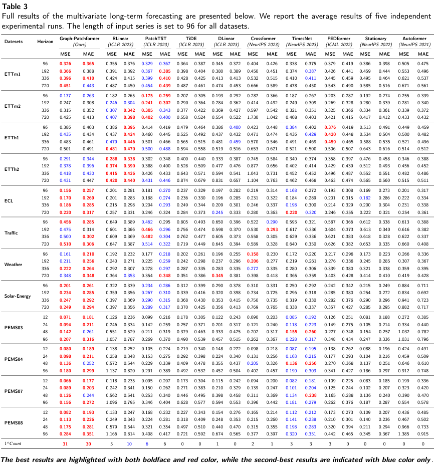

Graph-Patchformer: Patch interaction transformer with adaptive graph learning for multivariate time series forecasting
This work is currently in the revision stage and, if all goes well, will soon be presented to the public.If you would like to obtain our code in advance, please send an email to houchunyi@emails.bjut.edu.cn to get in touch with us. 
Please note that you must use your academic email address, as we are happy to share the code with researchers from academic institutions before the paper is published.
In this work, we conducted comparative experiments on twelve publicly available datasets, and the experimental results are as follows:

