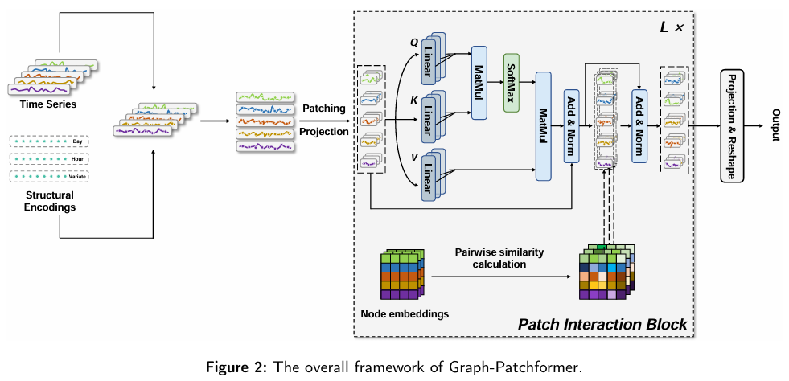
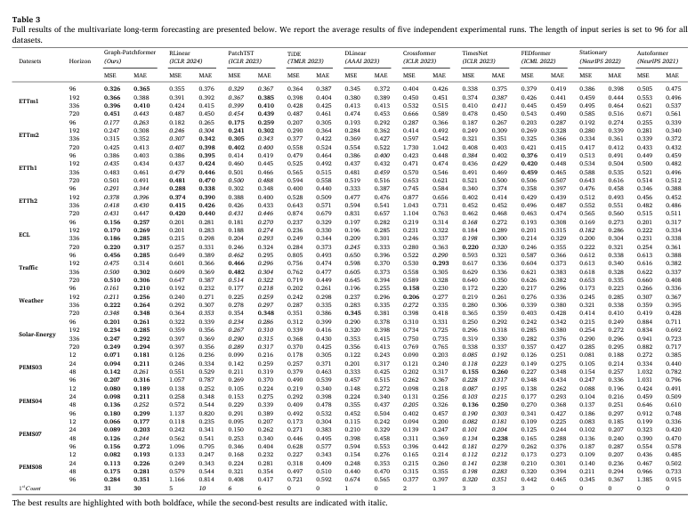
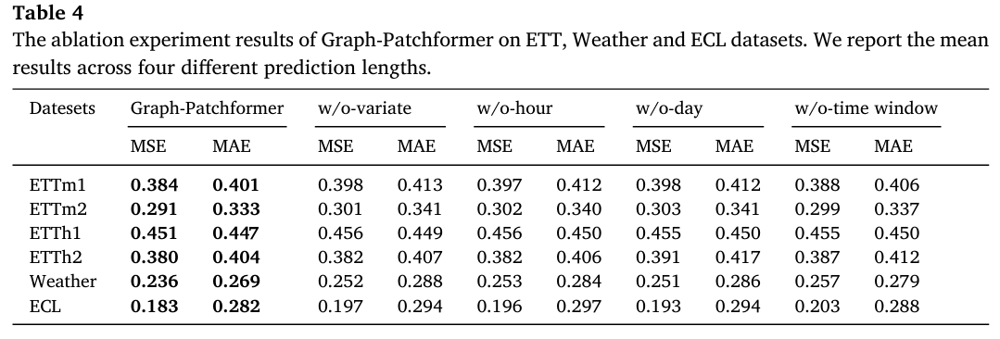
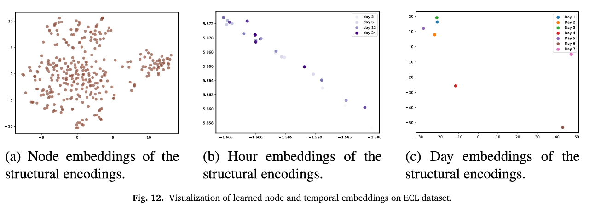

# 🚀 Graph-Patchformer: Patch interaction transformer with adaptive graph learning for multivariate time series forecasting 


🚩This work has been accepted by ***Neural Networks***!

😔 Apologies for not releasing the code for this work sooner, as I have been dealing with many tasks recently.


The overall architecture of **Graph-Patchformer** is shown below:
<p align="center">

</p>

🔥In this work, we compared nine widely known neural predictors:

- ✅ **PatchTST (***ICLR2023***)** - A Time Series is Worth 64 Words: Long-term Forecasting with Transformers [[ICLR 2023]](https://openreview.net/pdf?id=Jbdc0vTOcol) [[Code]](https://github.com/thuml/Time-Series-Library/blob/main/models/PatchTST.py).
- ✅ **DLinear (***AAAI2023***)** - Are Transformers Effective for Time Series Forecasting? [[AAAI 2023]](https://arxiv.org/pdf/2205.13504.pdf) [[Code]](https://github.com/thuml/Time-Series-Library/blob/main/models/DLinear.py).
- ✅ **TimesNet (***ICLR2023***)** - TimesNet: Temporal 2D-Variation Modeling for General Time Series Analysis [[ICLR 2023]](https://openreview.net/pdf?id=ju_Uqw384Oq) [[Code]](https://github.com/thuml/Time-Series-Library/blob/main/models/TimesNet.py).
- ✅ **FEDformer (***ICML2022***)** - FEDformer: Frequency Enhanced Decomposed Transformer for Long-term Series Forecasting [[ICML 2022]](https://proceedings.mlr.press/v162/zhou22g.html) [[Code]](https://github.com/thuml/Time-Series-Library/blob/main/models/FEDformer.py).
- ✅ **Non-stationary Transformer (***NeurIPS2021***)** - Non-stationary Transformers: Exploring the Stationarity in Time Series Forecasting [[NeurIPS 2022]](https://openreview.net/pdf?id=ucNDIDRNjjv) [[Code]](https://github.com/thuml/Time-Series-Library/blob/main/models/Nonstationary_Transformer.py).
- ✅ **Autoformer (***NeurIPS2021***)** - Autoformer: Decomposition Transformers with Auto-Correlation for Long-Term Series Forecasting [[NeurIPS 2021]](https://openreview.net/pdf?id=I55UqU-M11y) [[Code]](https://github.com/thuml/Time-Series-Library/blob/main/models/Autoformer.py).
- ...


The baseline results in the paper are reported in **iTransformer(***ICLR2024***)**.
Note that we did not fine-tune hyperparameters such as learning rate, objective function, etc., and we did not use **drop-last** during the inference process.


🔥In this work, we conducted comparative experiments on twelve publicly available benchmark, and the experimental results are as follows:
<p align="center">

</p>

🔥The results of the ablation experiments are as follows:
<p align="center">

</p>

🔥A visualization showcase study with learnable embeddings:
<p align="center">

</p>

😄If you would like to know more, please refer to the original paper. Thank you for your interest in this work!


## Getting Started

### Prepare Data
You can obtain the well-preprocessed datasets from [[Google Drive]](https://drive.google.com/drive/folders/13Cg1KYOlzM5C7K8gK8NfC-F3EYxkM3D2?usp=sharing), [[Baidu Drive]](https://pan.baidu.com/s/1r3KhGd0Q9PJIUZdfEYoymg?pwd=i9iy) or [[Hugging Face]](https://huggingface.co/datasets/thuml/Time-Series-Library). Then place the downloaded data in the folder `./datasets/`.


### Installation

1. Create a new Conda environment.
   ```bash
   conda create -n Graph_patchformer python=3.11
   conda activate Graph_patchformer
   ```
2. Install Core Dependencies
   ```bash
   pip install -r requirements.txt
   ```

### Train and Evaluate
We report the experimental hyperparameter setup in the paper, and you can reproduce the experiments based on the parameters described therein.

For all experiments, we trained the model using multiple GPUs. Specifically, we used four NVIDIA 2080Ti GPUs for data parallelism.
This is due to hardware limitations; in fact, the experiment can be successfully conducted with a single GPU.


```bash
export CUDA_VISIBLE_DEVICES='1,2,3,4'

model_name=Graph-Patchformer

python -u run.py \
   --task_name long_term_forecast \
   --is_training 1 \
   --root_path ./datasets/ \             # change fold that your own root path
   --data custom \
   --data_path electricity.csv \         # change data like ETTh1.csv 
   --model_id electricity_96_96 \
   --model $model_name \
   --d_model 256 \
   --features M \
   --seq_len 96 \
   --pred_len 96 \
   --train_epochs 10 \
   --patience 3 \
   --e_layers 3 \
   --enc_in 321 \
   --dec_in 321 \
   --c_out 321 \
   --des 'Exp' \
   --d_ff 512 \
   --n_heads 16 \
   --learning_rate 0.001 \
   --dropout 0.2 \
   --batch_size 16 \
   --itr 1
 
```
The above is a example of **ECL** benchmark. Please use the hyperparameter combination settings script reported in our paper to reproduce the results of the comparison experiments.
The random seeds used for the comparison experiments are **2021, 2022, 2023, 2024, and 2025**.
However, we would like to clarify that although we have reported the seeds, this does not guarantee perfect reproduction of the results, as there are many factors that can affect the outcome, such as GPU type, computational precision, CUDA version, PyTorch version, NumPy version, and so on.
However, according to our tests, performance actually improves when changing the experimental environment, such as running on the NVIDIA RTX4090. In any case, we have clarified all training and experimental details as much as possible. If you have any questions, please feel free to email us or ask in this repository. Thank you!


## Citation
If you find this repo useful, please cite our paper.
```
@article{hou2025graph,
  title={Graph-patchformer: Patch interaction transformer with adaptive graph learning for multivariate time series forecasting},
  author={Hou, Chunyi and Yu, Yongchuan and Ji, Jinquan and Zhang, Siyao and Shen, Xumeng and Yan, Jianzhuo},
  journal={Neural Networks},
  pages={108140},
  year={2026},
  publisher={Elsevier},
  doi={https://doi.org/10.1016/j.neunet.2025.108140},
  url={https://www.sciencedirect.com/science/article/pii/S0893608025010202}
}
```
## Contact
If you have any questions or suggestions, feel free to contact me:
- Chunyi Hou (Master student, houchunyi@emails.bjut.edu.cn)


## Acknowledgement
This library is constructed based on the following repos:
- Time-Series-Library: https://github.com/thuml/Time-Series-Library.

## More Related Works
If you are interested in our work, please stay tuned for more. In this regard, we would like to recommend some of our other works. If you are focused on time series and have an interest, we sincerely invite you to explore the following works:
```
@article{ding2025timemosaic,
  title={TimeMosaic: Temporal Heterogeneity Guided Time Series Forecasting via Adaptive Granularity Patch and Segment-wise Decoding},
  author={Ding, Kuiye and Fan, Fanda and Hou, Chunyi and Wang, Zheya and Wang, Lei and Yang, Zhengxin and Zhan, Jianfeng},
  journal={arXiv preprint arXiv:2509.19406},
  year={2025}
}
```
This work has been accepted by **AAAI2026**!

In the future, we will strive to release more solid work. Thank you all for your attention!


